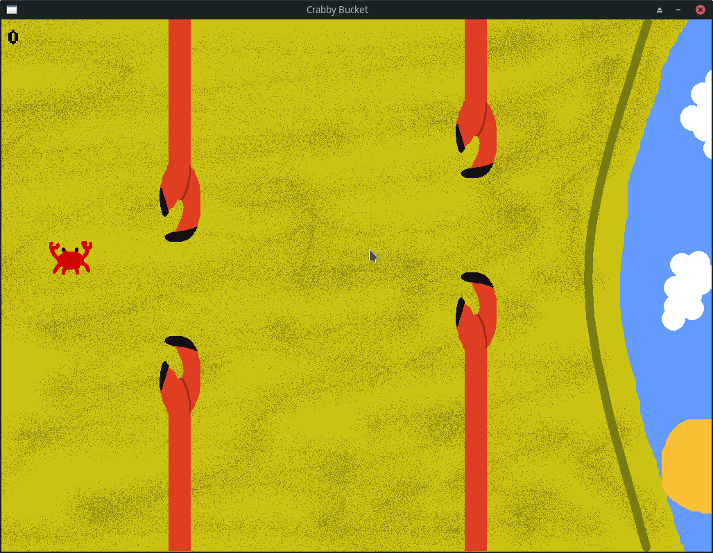

# Crabby Bucket
Crabby bucket is a flappy bird clone made with C++ and Raylib. It is a simple game where you control a crab and try to
avoid the other crabs trying to bring you back into the bucket. It's very simple and doesn't have many features, but I
may eventually add more to it like high score tracking and animations.

